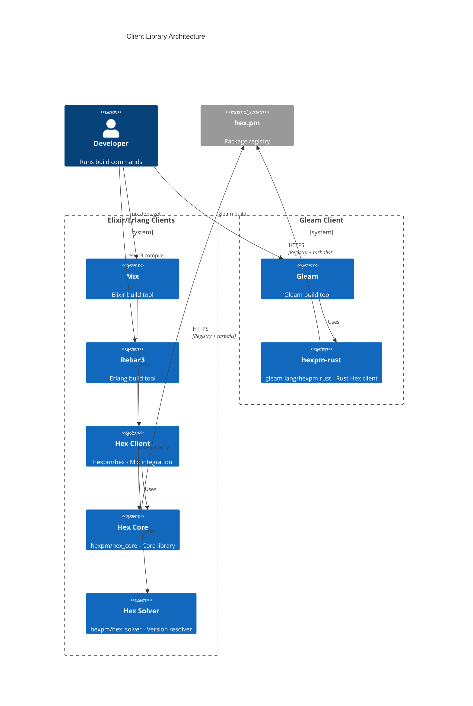
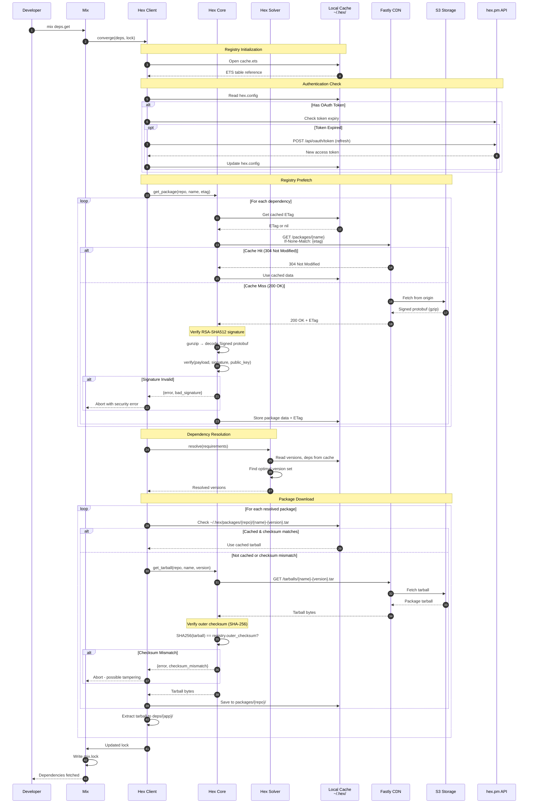
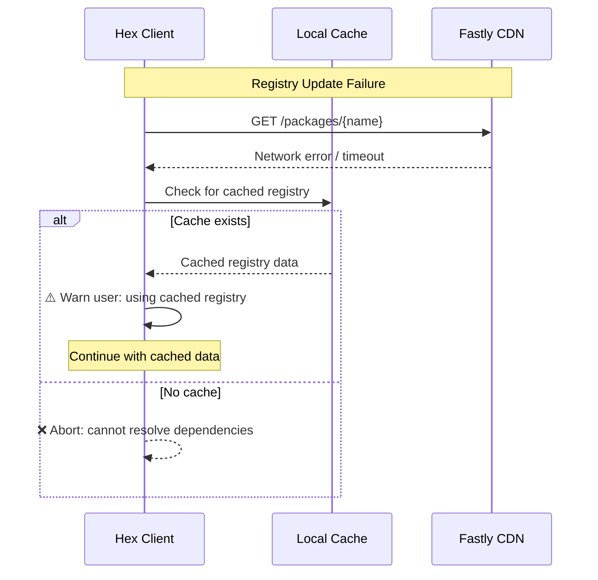
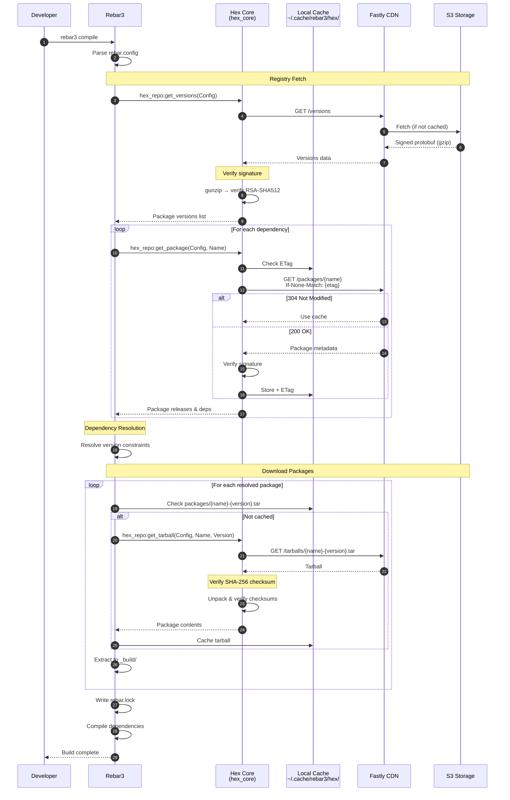
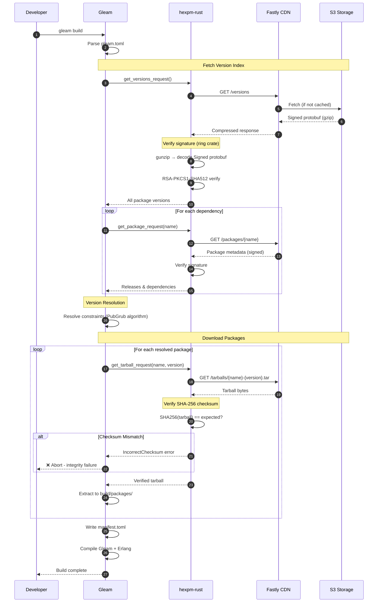
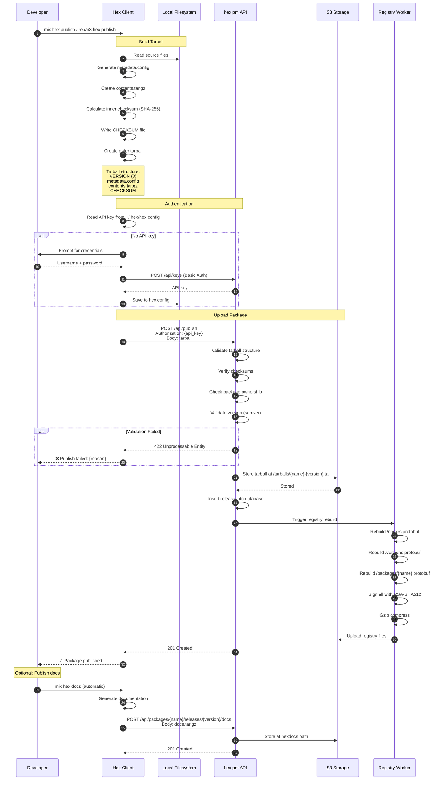
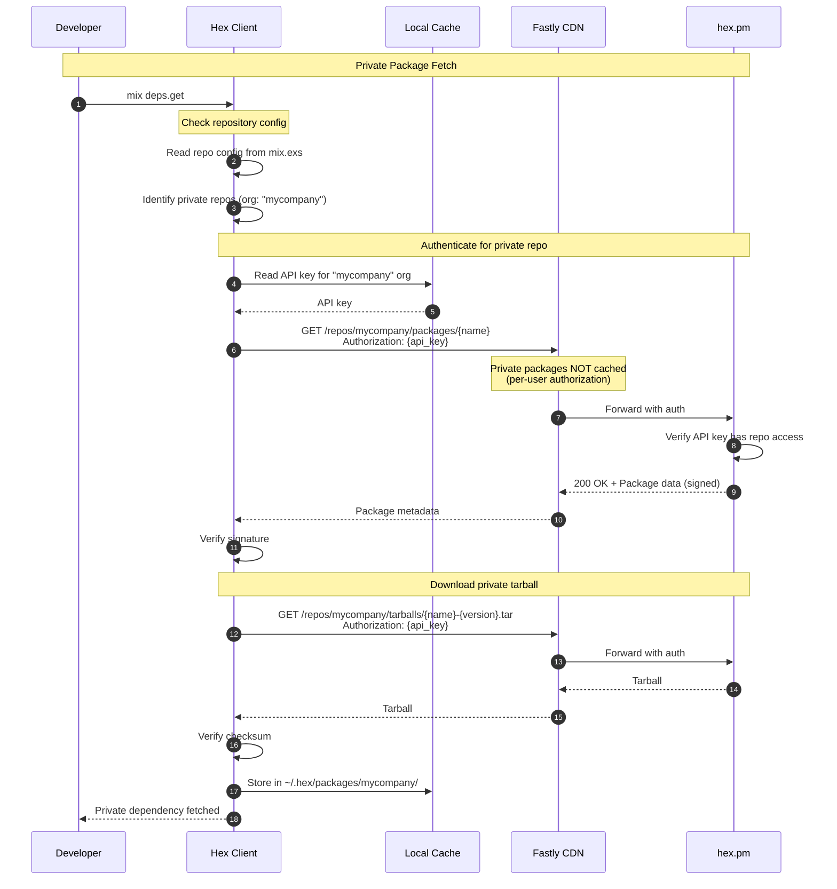
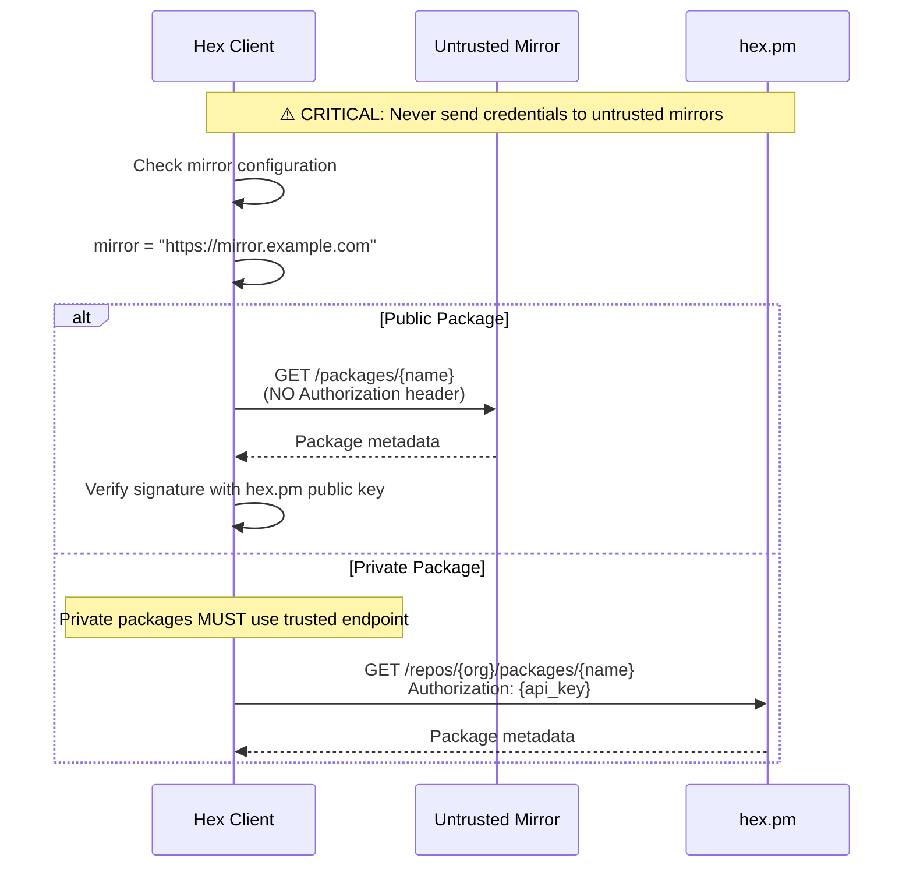

# Client Flows

This document describes how package manager clients interact with the Hex ecosystem, including API calls, caching behavior, and verification flows.

## Client Architecture Overview

---

## 1. Mix (Elixir) Dependency Installation

Command: `mix deps.get`

### Cache Locations

| Cache | Path | Contents |
|-------|------|----------|
| Registry | `~/.hex/cache.ets` | ETS file with package versions, deps, checksums |
| Packages | `~/.hex/packages/hexpm/{package}-{version}.tar` | Downloaded tarballs |
| Config | `~/.hex/hex.config` | API keys (encrypted), OAuth tokens |
| ETags | Inside `cache.ets` | `{:registry_etag, repo, package}` |

Environment variable `HEX_HOME` overrides the default `~/.hex` location.

### Sequence Diagram

### Error Handling

---

## 2. Rebar3 (Erlang) Dependency Installation

Command: `rebar3 compile` (with hex plugin)

### Cache Locations

| Cache | Path | Contents |
|-------|------|----------|
| Registry | `~/.cache/rebar3/hex/hexpm/registry/` | Registry protobuf files |
| Packages | `~/.cache/rebar3/hex/hexpm/packages/` | Downloaded tarballs |
| Lock | `rebar.lock` | Resolved versions with checksums |

### Sequence Diagram

---

## 3. Gleam Dependency Installation

Command: `gleam build`

### Cache Locations

| Cache | Path | Contents |
|-------|------|----------|
| Packages | `~/.cache/gleam/hex/hexpm/packages/` | Downloaded tarballs |
| Build | `./build/` | Compiled packages |
| Manifest | `manifest.toml` | Resolved versions with checksums |

### Sequence Diagram

---

## 4. Package Publishing

Command: `mix hex.publish` or `rebar3 hex publish`

### Sequence Diagram

---

## 5. Private Package Flow

For organizations with private packages on hex.pm.

### Endpoints

Private packages use repository-scoped endpoints:

| Endpoint | Description |
|----------|-------------|
| `/repos/{org}/names` | Package names in organization |
| `/repos/{org}/versions` | Package versions in organization |
| `/repos/{org}/packages/{name}` | Package metadata |
| `/repos/{org}/tarballs/{name}-{version}.tar` | Package tarball |

### Sequence Diagram

### Security: Untrusted Mirrors

---

## Verification Summary

All clients perform these verification steps:

### Registry Verification

1. **Decompress** - gunzip the response
2. **Decode** - Parse `Signed` protobuf wrapper
3. **Verify Signature** - RSA-PKCS1-SHA512 of payload using hex.pm public key
4. **Verify Repository** - Ensure `repository` field matches expected repo name
5. **Parse Payload** - Decode inner protobuf (Names, Versions, or Package)

### Tarball Verification

1. **Download** - Fetch tarball from `/tarballs/{name}-{version}.tar`
2. **Outer Checksum** - `SHA256(entire tarball)` must match registry's `outer_checksum`
3. **Extract** - Unpack tar to get VERSION, metadata.config, contents.tar.gz, CHECKSUM
4. **Inner Checksum** - Verify CHECKSUM file matches `SHA256(VERSION + metadata.config + contents.tar.gz)`

### Public Key

The hex.pm public key is:
- Distributed with client libraries (hardcoded)
- Available at `https://hex.pm/docs/public_keys`
- 2048-bit RSA key used for RSA-PKCS1-SHA512 signatures
