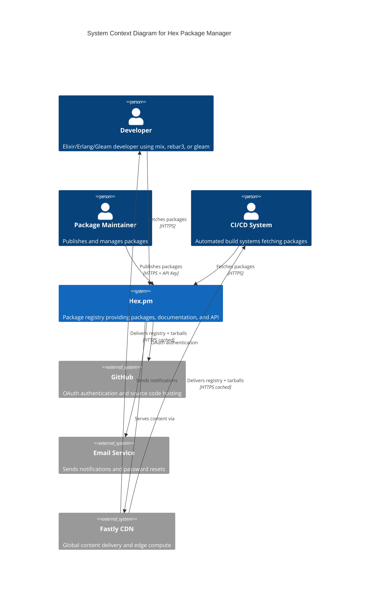
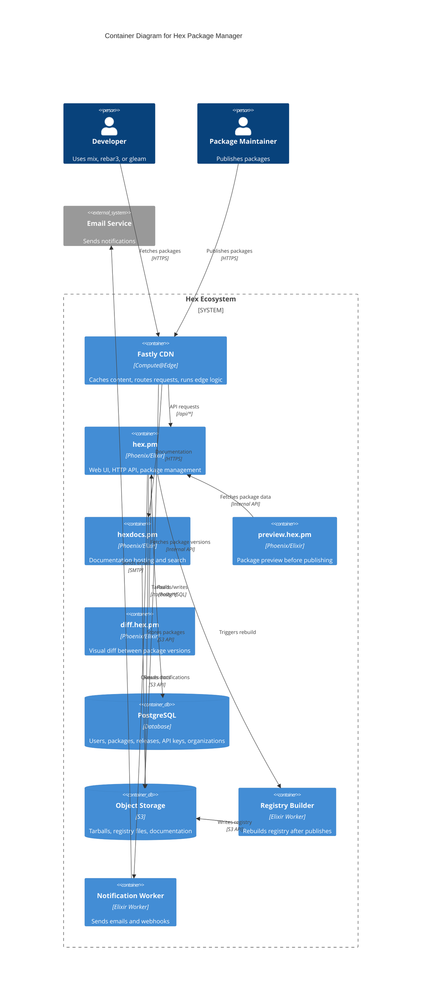
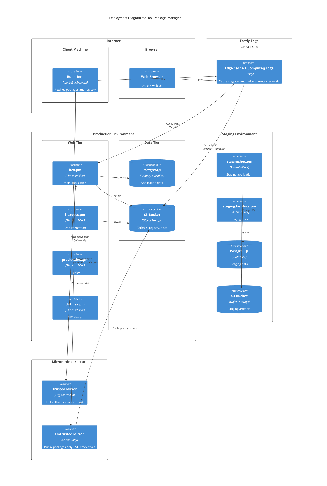
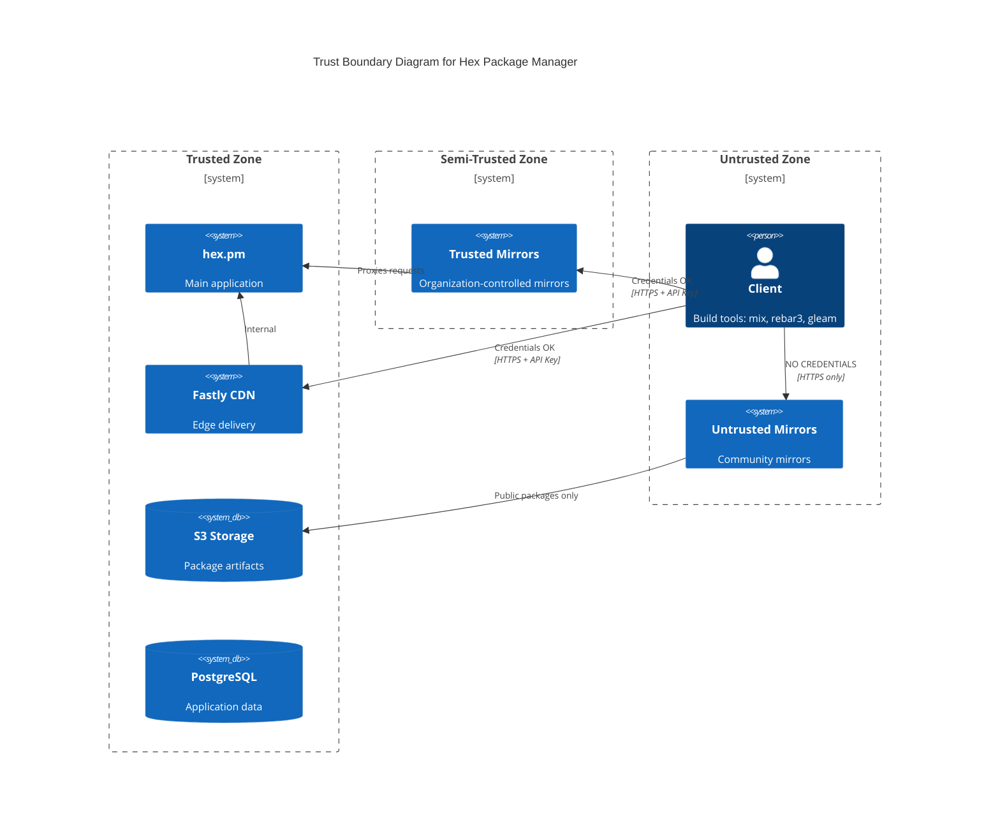

# Hex Infrastructure

This document provides architectural diagrams for the Hex package manager ecosystem using the C4 model.

## Ecosystem Inventory

### Hex Services

| Name | Description | Production | Staging | Repository |
|------|-------------|------------|---------|------------|
| Hex Registry | Main registry, web UI & API | hex.pm | staging.hex.pm | [hexpm/hexpm](https://github.com/hexpm/hexpm) |
| Hex Operations | Terraform, Config, Fastly Compute | - | - | [hexpm/hexpm-ops](https://github.com/hexpm/hexpm-ops) (🔒) |
| Hex Docs | Documentation hosting | hexdocs.pm | staging.hexdocs.pm | [hexpm/hexdocs](https://github.com/hexpm/hexdocs), [hexpm/hexdocs-search](https://github.com/hexpm/hexdocs-search) |
| Hex Preview | Package preview | preview.hex.pm | - | [hexpm/preview](https://github.com/hexpm/preview) |
| Hex Diff | Package diff viewer | diff.hex.pm | - | [hexpm/diff](https://github.com/hexpm/diff) |

### Client Libraries

| Name | Description | Repository |
|------|-------------|------------|
| Hex | Elixir Hex client | [hexpm/hex](https://github.com/hexpm/hex) |
| Hex Core | Core library for Elixir/Erlang clients | [hexpm/hex_core](https://github.com/hexpm/hex_core) |
| Hex Solver | Version constraint resolver | [hexpm/hex_solver](https://github.com/hexpm/hex_solver) |
| hexpm-rust | Rust Hex client (used by Gleam) | [gleam-lang/hexpm-rust](https://github.com/gleam-lang/hexpm-rust) |

### Build Tools

| Name | Description | Repository |
|------|-------------|------------|
| Mix | Elixir build tool | [elixir-lang/elixir](https://github.com/elixir-lang/elixir) (lib/mix) |
| Rebar3 | Erlang build tool | [erlang/rebar3](https://github.com/erlang/rebar3) |
| Gleam | Gleam language & build tool | [gleam-lang/gleam](https://github.com/gleam-lang/gleam) |

---

## C4 Level 1: System Context

Shows the Hex ecosystem and its relationships with users and external systems.

### Context Description

**Users:**
- **Developers** fetch packages during development and CI builds
- **Package Maintainers** publish and manage packages via the web UI or CLI
- **CI/CD Systems** fetch packages during automated builds

**External Systems:**
- **GitHub** provides OAuth authentication and hosts package source code
- **Email Service** sends password resets, ownership notifications, etc.
- **Fastly CDN** caches and delivers registry files and package tarballs globally

---

## C4 Level 2: Container Diagram

Shows the internal services and data stores within the Hex ecosystem.

### Container Descriptions

**CDN Layer:**
- **Fastly CDN + Compute@Edge**: Handles all incoming traffic, caches registry files and tarballs, routes requests to appropriate origins. Compute@Edge runs custom logic from hexpm-ops.

**Hex Services:**
- **hex.pm**: Main Phoenix application providing web UI, HTTP API (`/api/*`), and repository endpoints. Handles authentication, package publishing, user management, and organization management.
- **hexdocs.pm**: Serves generated documentation for packages. Integrates with hexdocs-search for documentation search.
- **preview.hex.pm**: Allows maintainers to preview how a package will appear before publishing.
- **diff.hex.pm**: Provides visual diffs between package versions for security review.

**Data Stores:**
- **PostgreSQL**: Primary database storing users, packages, releases, dependencies, API keys, organizations, and audit logs.
- **Object Storage (S3)**: Stores package tarballs, documentation tarballs, and pre-built registry files (protobuf + gzip + signed).

**Background Workers:**
- **Registry Builder**: Triggered after package publish/update to rebuild registry files (`/names`, `/versions`, `/packages/*`).
- **Notification Worker**: Sends email notifications for password resets, ownership changes, security advisories.

---

## C4 Deployment Diagram

Shows the infrastructure deployment topology.

### Deployment Notes

**CDN Strategy:**
- All traffic flows through Fastly edge locations globally
- Registry files (`/names`, `/versions`, `/packages/*`) are heavily cached
- Tarballs are cached with long TTLs (immutable content)
- API requests (`/api/*`) pass through to origin

**Trust Boundaries:**
- **Trusted path**: Client → Fastly → hex.pm (credentials safe)
- **Untrusted mirrors**: Clients MUST NOT send credentials; only fetch public packages

**Staging:**
- `staging.hex.pm` and `staging.hexdocs.pm` for testing
- Separate database and storage from production

**High Availability:**
- S3 provides durability for package artifacts
- Fastly provides global redundancy

---

## Communication Protocols

| Path | Protocol | Format | Authentication |
|------|----------|--------|----------------|
| Client → Registry files | HTTPS | Protobuf + gzip + RSA-SHA512 signed | None (public) or API key (private) |
| Client → Tarballs | HTTPS | tar (VERSION, metadata.config, contents.tar.gz, CHECKSUM) | None (public) or API key (private) |
| Client → API | HTTPS | JSON | API key (Bearer token) |
| Browser → Web | HTTPS | HTML | Session cookie |
| hex.pm → PostgreSQL | TCP | PostgreSQL protocol | Connection credentials |
| hex.pm → S3 | HTTPS | S3 API | IAM credentials |

---

## Trust Boundaries

**Key Security Principle:** Clients must NEVER send API keys or authentication tokens to untrusted mirrors. Even if configured to use a mirror, authentication must be disabled for untrusted endpoints.
